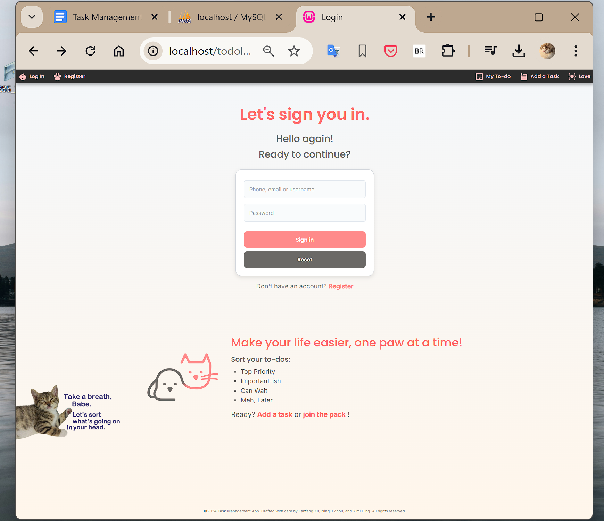
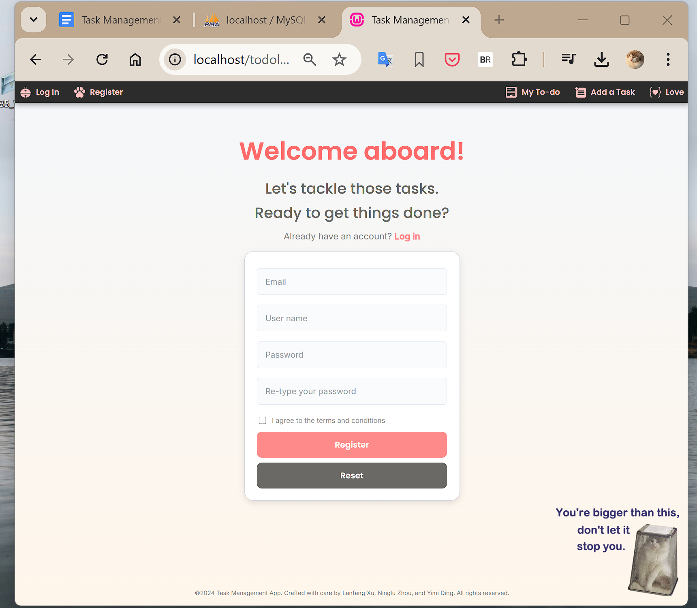
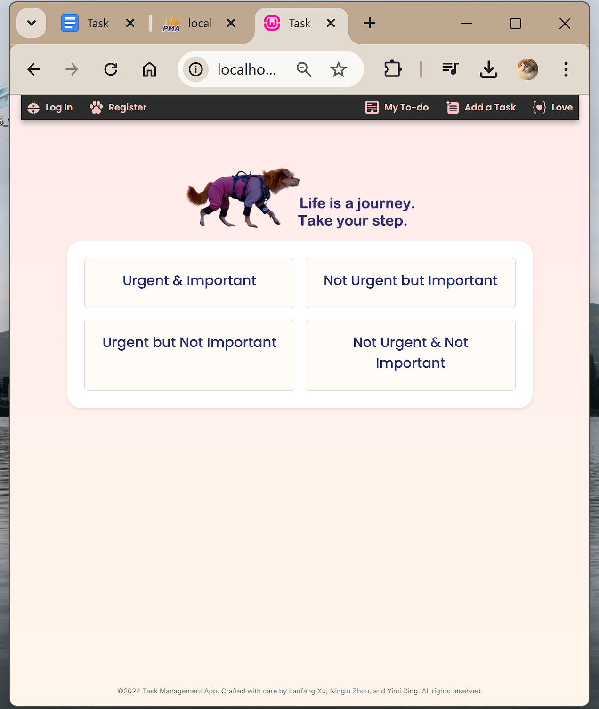
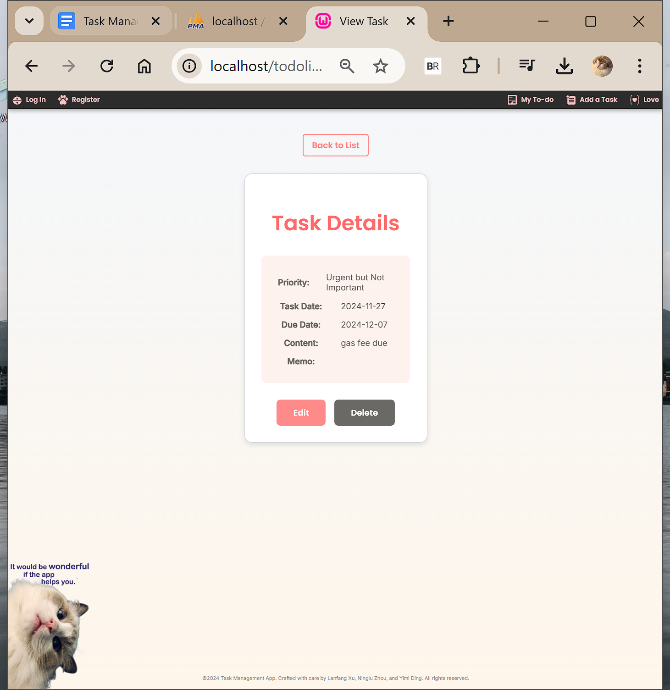
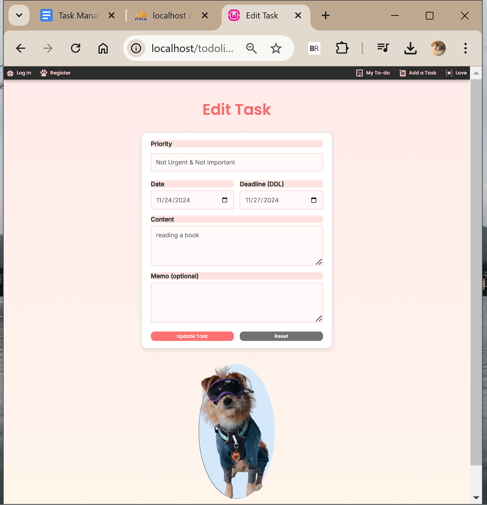
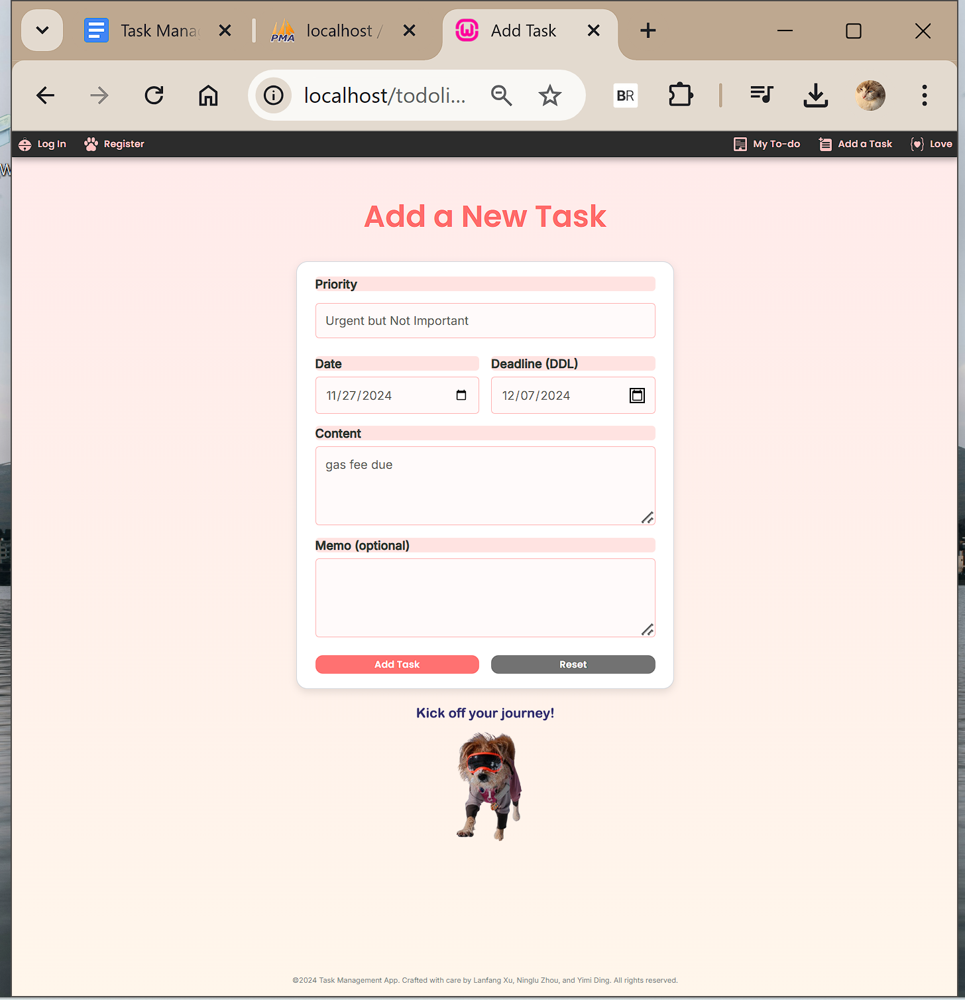
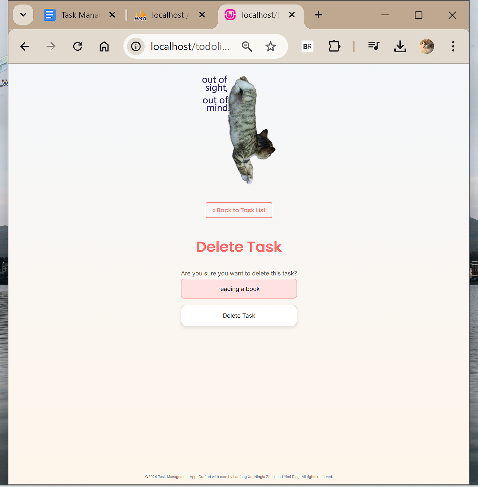
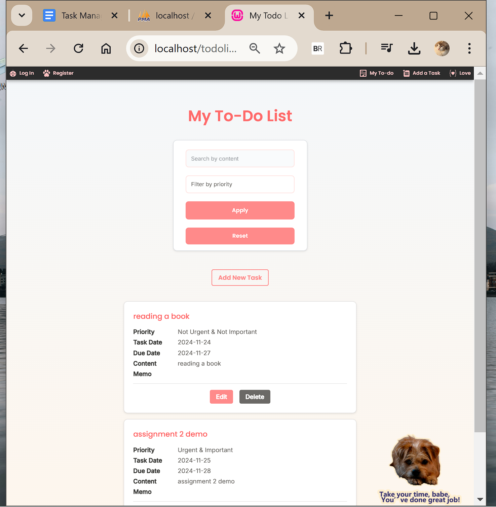

# Task Management System

A modern task management system built with PHP and MySQL, featuring user authentication and task organization capabilities.

## 🌟 Preview

![Project Preview]










## 🚀 Features

- User Management
  - Registration and Login
  - Session Management
  - Real-time Form Validation
- Task Management
  - Create, Read, Update, Delete Tasks
  - Priority Setting
  - Due Date Tracking
  - Task Memos
- Interface Design
  - Responsive Design
  - Mobile Support
  - Real-time Validation Feedback

## 💻 Tech Stack

- Frontend
  - HTML5
  - CSS3
  - JavaScript
- Backend
  - PHP
  - MySQL
  - Apache/Nginx

## 📋 Prerequisites

- PHP 7.0+
- MySQL 5.6+
- Apache/Nginx server
- Modern web browser with JavaScript enabled

## 🔧 Installation

1. Clone the repository
```bash
git clone https://github.com/yimi-ding/task-management.git
cd task-management
```

2. Import database schema
```bash
mysql -u root -p < setup_database.sql
```

3. Configure database connection
- Copy configuration template
```bash
cp db_credentials.example.php db_credentials.php
```

- Update database credentials
```php
define("DB_SERVER", "localhost");
define("DB_USER", "appuser");
define("DB_PASS", "password");
define("DB_NAME", "task_management");
```

4. Configure web server
- Apache configuration
```apache
<VirtualHost *:80>
    DocumentRoot "/path/to/task-management"
    ServerName your-domain.com
    
    <Directory "/path/to/task-management">
        AllowOverride All
        Require all granted
    </Directory>
</VirtualHost>
```

- Nginx configuration
```nginx
server {
    listen 80;
    server_name your-domain.com;
    root /path/to/task-management;

    location / {
        try_files $uri $uri/ /index.php?$query_string;
    }

    location ~ \.php$ {
        fastcgi_pass unix:/var/run/php/php7.4-fpm.sock;
        fastcgi_index index.php;
        fastcgi_param SCRIPT_FILENAME $document_root$fastcgi_script_name;
        include fastcgi_params;
    }
}
```

5. Access the application
- Open your web browser
- Navigate to `http://localhost/task-management`

## 📝 Database Structure

### Users Table
```sql
CREATE TABLE users (
    id INT AUTO_INCREMENT PRIMARY KEY,
    username VARCHAR(50) NOT NULL,
    password VARCHAR(50) NOT NULL
);
```

### Tasks Table
```sql
CREATE TABLE tasks (
    id INT AUTO_INCREMENT PRIMARY KEY,
    user_id INT NOT NULL,
    priority VARCHAR(50) NOT NULL,
    task_date DATE NOT NULL,
    due_date DATE NOT NULL,
    content TEXT NOT NULL,
    memo TEXT,
    FOREIGN KEY (user_id) REFERENCES users(id)
);
```

## 📄 API Documentation

### Authentication

#### Register
```http
POST /api/register.php

Request:
{
    "username": "string",
    "password": "string"
}

Response:
{
    "status": "success",
    "message": "Registration successful"
}
```

#### Login
```http
POST /api/login.php

Request:
{
    "username": "string",
    "password": "string"
}

Response:
{
    "status": "success",
    "token": "string"
}
```

### Task Management

#### Create Task
```http
POST /api/tasks/create.php

Request:
{
    "priority": "string",
    "content": "string",
    "due_date": "date"
}

Response:
{
    "status": "success",
    "task_id": "number"
}
```

## 🔒 Security Notes

1. Password Storage
- Use password hashing in production
- Recommended: PHP's `password_hash()` function

2. SQL Injection Prevention
- Use MySQLi prepared statements
- Avoid direct SQL string concatenation

3. XSS Protection
- Use `htmlspecialchars()` for output escaping
- Implement CSP policies

## 👥 Authors

- Lanfang Xu
- Ninglu Zhou
- Yimi Ding


## 🤝 Contributing

1. Fork the repository
2. Create your feature branch
    ```bash
    git checkout -b feature/AmazingFeature
    ```
3. Commit your changes
    ```bash
    git commit -m 'Add some AmazingFeature'
    ```
4. Push to the branch
    ```bash
    git push origin feature/AmazingFeature
    ```
5. Open a Pull Request

## 🙏 Acknowledgments

- Thanks to Dr. Hala for guidance
- Thanks to all contributors
- Special thanks to our pets: 
  - Douya
  - Hachi
  - Damao & Xiaomao

## 📞 Contact

For any questions, please reach out:
- Send email to [your-email@example.com]

## ⚠️ Disclaimer

This project is for educational purposes only. Not for commercial use.